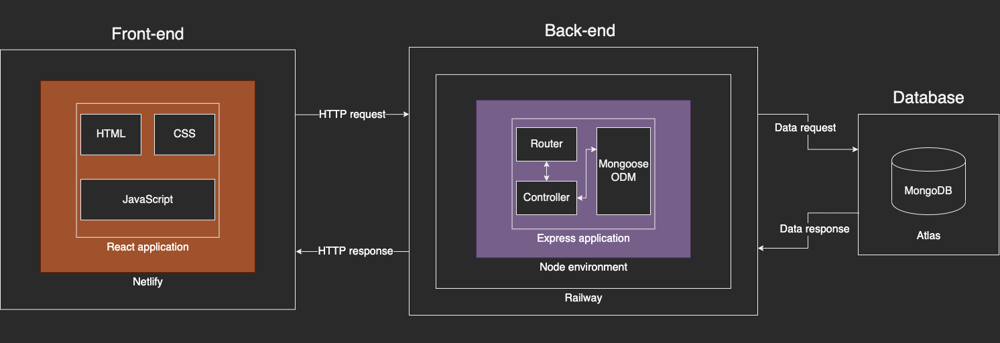

# **_*fruGo*_**

## **R1: Description of website**

### **Concept**

fruGo is an online fresh produce ordering & delivery company that has been providing Australians with their fruit and vegetables since 2003. With small family owned dispatch facilities in each major city of the country, fruGo has enjoyed being Australia’s most trusted whole food supplier for two decades.
Originally trading as a phone-order service with a proud emphasis on customer relationships, recent rapid growth in demand due to the COVID pandemic has prompted a major upgrade and overhaul of their web marketplace to reflect today’s digital shopping landscape and offer our customers a modernised and improved user experience.
When the world was forced into a predominantly online market in early 2020, fruGo faced challenges competing with other large supermarket chains that offered delivery due to their scale and convenience, however once our new vision of a purely web-based delivery powerhouse is realised, fruGo is confident that it will once again lead the market as Australia’s fresh food supplier.

### **Purpose**

The purpose of building a new online platform for fruGo is to utilise modern technologies to improve the reliability and delivery performance for customers and merchants alike.
Previously, customers would manually choose which merchant to order from and place orders via a telephone service. fruGo believes that a successful business is an efficient one, so this process will be streamlined with the use of an online commerce platform using automated processes to automatically evaluate the closest merchant able to fulfill their particular order, enhancing the process for everyone.
fruGo is passionate about the freshness of their produce and reducing food wastage, and we believe that the need to bulk-buy to reduce visits to physical grocery stores is depriving the public of truly fresh food. Not only do we aim to make ordering quick and stress-free, we have no delivery fee so that our customers can only order what they need, more frequently!
Customers can also instantly view product quantities in their respective city to reduce stock issues.
Merchants can now manage their stock quantities in an online database, which is automatically updated by customer orders, reducing the need for manual stock-takes and customer enquiries.

### **Features & functionalities**

fruGo’s online platform is a dynamic website that will be built off of a REST API that interacts with a document-oriented database. The database will store various data entities as collections in a _MongoDB_ database, able to be interacted with and have various specified CRUD operations performed on them through _Mongoose_ Schema/models via _Express_ routes and logic controllers. This back-end logic will be accessed by users via an interactive front-end built with _React_.

The three external entities that will be interacting with the application are `Customers`, `Merchants` and `Admins`.

### `Customer`

**Actions:**

- Create a customer profile with login credentials and personal information
- View their profile
- Update their details
- Delete their profile
- Add and remove items to their cart
- Submit their cart and create an order
- Search for products
- Filter products by type

**Data model:**

```js
Customer {
  _id: "123ABC",
  email: "customer@email.com",
  password: "...",
  firstName: "John",
  lastName: "Smith",
  city: { <City> },
  streetAddress: "123 Fake street",
  cart: { <Cart> },
}
```

### `Merchant`

**Actions:**

- View their profile
- Update their profile details
- View their stock/product quantities
- Update their stock quantities
- Add and remove products from their inventory
- View their pending and completed orders
- Cancel their orders

**Data model:**

```js
Merchant {
  _id: "...",
  email: "merchant@email.com",
  password: "...",
  name: "Fresh Food Sydney",
  description: "The freshest food in Sydney",
  city: { <City> },
  products: [ ... { <Product> }, { <Product> } ],
}
```

### `Admin`

**Actions:**

- View all non-sensitive data of customers/merchants
- View all orders and cancel/update if needed
- Add and remove products from merchant's stock
- Perform all other tasks other than view/update sensitive data

```js
Admin {
  _id: "...",
  email: "admin@email.com",
  password: "...",
  firstName: "Chief",
  lastName: "Admin",
}
```

The data models that these external entities will be interacting with are `Products`, `Carts`, `Orders` & `Cities`.

### `Product`

**Data model:**

```js
Product {
  _id: "..."
  name: "Banana",
  type: "Fruit"
}
```

### `Cart`

**Data model:**

```js
Cart {
  _id: "..."
  customer: <Customer ID>,
  merchant: <Merchant ID>,
  products: [ ... { { <Product> }, quantity: 5 }, { { <Product> }, quantity: 1 } ],
  totalPrice: 39,
  createdAt: "2023-02-03",
}
```

### **Target audience**

**Income level**: Middle to upper-middle class
**Location**: Metropolitan areas in Australian major cities
**Age**: 25-34 years old
**Occupation**: Busy full-time employees with little time to visit grocery store
**Education** level: Moderately educated individuals with a decent understanding of modern technology
**Language**: English
**Gender**: All
**Devices**: Smart phone (iOS & Android), tablets, desktop
**Motivation**:To simplify and streamline buying fresh food so that they have more free time
**Needs**:

- An easy to understand and straight-forward user interface
- Clear pricing
- Ability to modify their cart
- Location-based merchant selection for rapid delivery
- Visibility for merchants

## **R2: Dataflow Diagrams**

## **R3: Application Architecture Diagram**



## **R4: User Stories**

**_As the owner/admin of the fruGo company, I would like:_**

[ ] To have full control (all CRUD functionality) over 'customers' & 'merchants', so that unwanted users can be removed and unexpected errors can be handled.

[ ] **_Merchants_** can only be added by me, so that unwanted merchants aren't selling unapproved products

**_As a merchant of fruGo, I would like:_**

[ ] To view/edit my profile in order to provide accurate information my store

[ ] Each customer must be signed in order to view the available products

[ ] To **_update_** my current product availability/stock, to make sure all products are up to date

[ ] **_Add/Create_** new products to my store, to keep up with customer demand

[ ] **_Delete_** any of my product listings (if needed), so that customers aren't purchasing unavailable products

[ ] To view both 'pending' and 'completed' orders

[ ] Delete 'pending' orders if stock isn't available in order to notify users that their order was unsuccessful (with the provided reason)

[ ] To mark pending orders from customers as completed to notify customers that their order was successful

[ ] Every completed **_ORDER_** by a customer to be sent to me, in order to keep receipts of all transactions

[ ] Completed orders to update the stock of the purchased products, in order to communicate to customers how much stock is left

**_As a customer of fruGo, I would like:_**

[ ] To create an account in order to store my information for future orders and save past orders as well

[ ] Edit my account information so that it's up to date, and the option to delete my account in not needed anymore

[ ] To have a Sign in/Sign up Page, in order to ensure online user authentication

[ ] To only view products that are available in my city, in order get the fastest delivery possible

[ ] To search for products, in order find them quickly without scrolling through all products at once

[ ] Filter products by type, to enhance the searching experience

[ ] Add desired products to a temporary cart in order to keep shopping until I'm ready to finalise my order

[ ] Remove products from a cart in case I don't want them anymore

```

```

```

```
